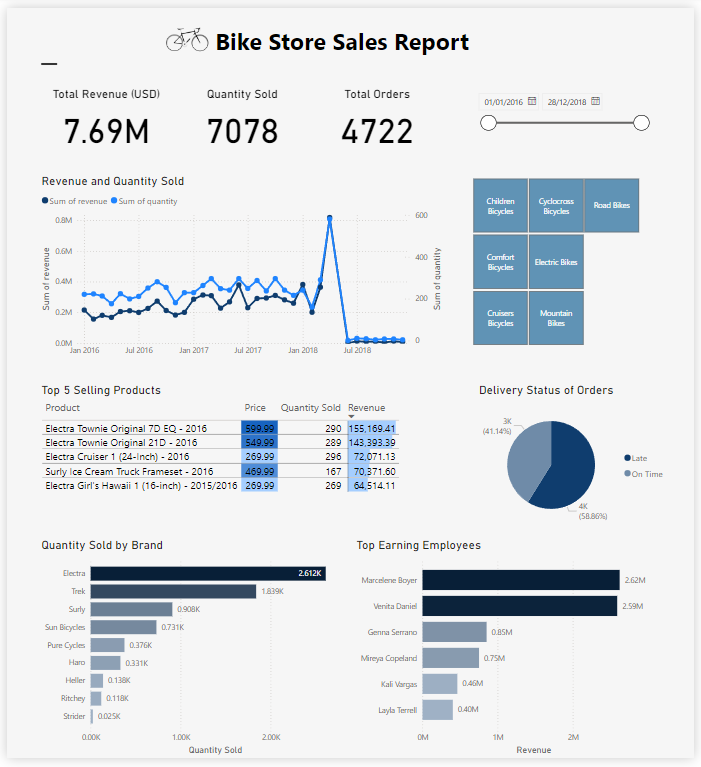
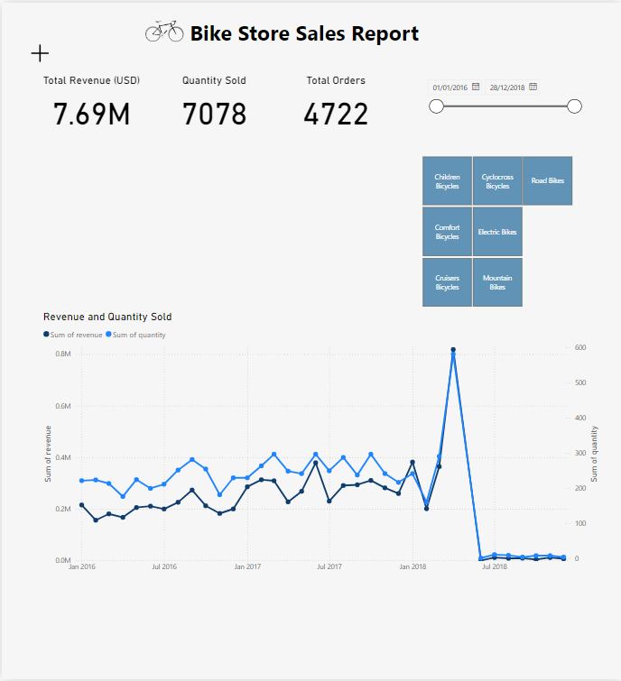

## Introduction
This project involves using a bike stores database to practice and showcase SQL skills including CTEs, subqueries, stored procedures, window functions, and temp tables. The dataset includes nine tables related to brands, categories, products, stocks, customers, orders, order items, staff, and stores.
The main purpose of this project is to perform data analysis and derive meaningful insights using SQL to guide dashboard development in Power BI.
 
## Tools Used
- **SQL Server**: For database management and executing queries.
- **GitBash**: For version control and managing the repository.
- **Power BI**: For creating an interactive dashboard and visualisations based on the findings of the SQL queries.

## Analysis in SQL Server
The analysis involves writing queries to explore the data in all of the tables to find patterns, trends, and key information. Queries range from simple to more complex depending on the information that needs to be found.

Here are some of the queries performed, along with brief explanations.

- **Top 10 most expensive products**, to identify high-value items.
```sql
SELECT TOP 10
	product_name, 
	list_price
FROM production.products
ORDER BY list_price DESC
```

- **Products with a higher than average price**. This uses a subquery to calculate the mean price of all products and filter results by products with a price higher than the mean, sorting in descending order:
```sql
SELECT 
    product_name, 
    list_price
FROM 
    production.products
WHERE 
    list_price > (SELECT AVG(list_price) FROM production.products)
ORDER BY 
    list_price DESC;
```

- **Top selling categories** using joins. This query joins three tables and calculates the total revenue earned by each category and sorts in descending order:
```SQL
SELECT 
	c.category_name, 
	SUM(oi.quantity * oi.list_price) AS total_revenue
FROM production.categories c
JOIN production.products p ON c.category_id = p.category_id
JOIN sales.order_items oi ON p.product_id = oi.product_id
GROUP BY c.category_name
ORDER BY total_revenue DESC;
```

- **Running total of revenue using a CTE and window functions**. This defines a CTE named WeeklyRevenue that calculates weekly revenue.
It groups data by order_year and order_week, using DATEPART to extract the year and week from order_date, and computes weekly_revenue as the sum of quantity * list_price from sales.orders and sales.order_items.
The main query selects the year, week, and weekly revenue from the CTE, and calculates additional columns for the overall running total of revenue, and yearly running total of revenue, using window functions. This facilitates detailed analysis and comparison of revenue trends over time at different granularity levels:
```sql
WITH WeeklyRevenue AS (
    SELECT 
        DATEPART(YEAR, o.order_date) AS order_year,
        DATEPART(WEEK, o.order_date) AS order_week,
        SUM(oi.quantity * oi.list_price) AS weekly_revenue
    FROM 
        sales.orders o
    JOIN 
        sales.order_items oi ON o.order_id = oi.order_id
    GROUP BY 
        DATEPART(YEAR, o.order_date), DATEPART(WEEK, o.order_date)
)
SELECT 
    order_year,
    order_week,
    weekly_revenue,
    SUM(weekly_revenue) OVER (ORDER BY order_year, order_week) AS overall_running_total_revenue,
    SUM(weekly_revenue) OVER (PARTITION BY order_year ORDER BY order_week) AS yearly_running_total_revenue
FROM 
    WeeklyRevenue
ORDER BY 
    order_year, order_week;
```


- **Stored procedure** to return total sales revenue for each day within a specified period:
```sql
CREATE PROCEDURE GetSalesByDateRange @StartDate DATE, @EndDate DATE
AS
BEGIN
    SELECT 
        o.order_date,
        SUM(oi.quantity * oi.list_price) AS total_sales
    FROM 
        sales.orders o
    JOIN 
        sales.order_items oi ON o.order_id = oi.order_id
    WHERE 
        o.order_date BETWEEN @StartDate AND @EndDate
    GROUP BY 
        o.order_date
    ORDER BY 
        o.order_date;
END;

-- Executing a stored procedure 
EXEC GetSalesByDateRange @StartDate = '2017-01-01', @EndDate = '2017-12-31';
```
## What I learned
These queries allowed me to understand revenue trends, pricing information, and top selling categories in the bike stores dataset. These insights helped to guide further exploration for visualisation and dashboard development in Power BI. 

## Dashboard development in Power BI


- Using the insights gained using SQL, further data analysis and visualisation is performed in Power BI to create an interactive dashboard highlighting key findings in the data.
- A line graph is included to show the evolution of sales and revenue over time, and bar charts show the top selling products and top earning staff.
- DAX is used to categorise orders into 'On time' or 'Late' based on shipping information.
- Slicers are included to filter the data by time and product category.
- Cards are included at the top of the dashboard highlighting KPIs including total revenue, quantity sold and total orders.
- The dashboard has a minimised view to only show the line graph, which increases in size to better illustrate the sales trends.

